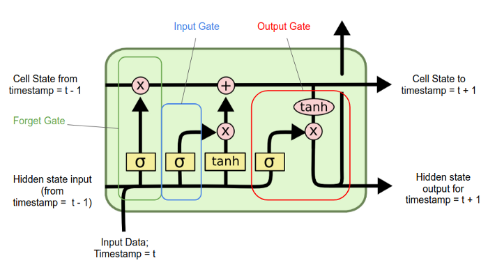

# Text Multiclass Classification


## Table of Contents

- [Data Cleaning](#data-Cleaning)
- [TF-IDF](#1-tf-idf)
- [Embedding layer and ANNs](#21-embedding-layer-and-anns)
- [Embedding layer and RNNs (LSTM)](#22-embedding-layer-and-rnns-lstm)
- [Pre-Trained Word Embeddings](#23-pre-trained-word-embeddings)


## Introduction
The aim of this project is to build a model that is able to assign to a document one of the following 9 classes:  Agent, Place, Species, Work, Event, SportsSeason, UnitOfWork , TopicalConcept, Device. The data set used to train and test our models  contains 342,782 wikipedia articles and it can be downloaded [here](https://www.kaggle.com/danofer/dbpedia-classes?select=DBP_wiki_data.csv). All the models I'm going to use for the classification step require continous explanatory variables, but in this case the only variable that we have at disposal is the text of the document. In order to solve this problem we can represent text or words of each documet as a numerical vector and this technique is called word embedding. Let's see how our target value is distributed.

<p align="center"></p>

We are in the case of an unbalanced data set, meaning that we have an unequal distribution of our classes. This might be a problem for our models, so we have to keep in mind this fact if we spot something strange in our classification.

## Data Cleaning

One important step when we deal with textual data is the data cleaning process, basically it aims to delete all the elements of a document that are not useful for the analysis. Let's take a look how our documents look with an example:

```python
>>> df["text"][1]
'The 1917 Bali earthquake occurred at 06:50 local time on 21 January (23:11 on 20 January UTC). It had an estimated magnitude of 6.6 on the surface wave magnitude scale and had a maximum perceived intensity of IX (Violent) on the Mercalli intensity scale. It caused widespread damage across Bali, particularly in the south of the island. It triggered many landslides, which caused 80% of the 1500 casualties.'

```
As we can see our text is full of elements that are not going to improve our classification such as numbers and stopwords. Another good thing to do is to trasform all letters into lowercase and everything can be done by the following code.

```python
def clean_text(text):

    text = text.lower()  # lowercase text
    text = REPLACE_BY_SPACE_RE.sub(' ',text)
    text = BAD_SYMBOLS_RE.sub('',text)

    text = ' '.join(word for word in text.split() if word not in STOPWORDS)
    return text


df['text'] = df['text'].apply(clean_text)
df['text'] = df['text'].str.replace('\d+', '')

```
Let's see how our documents have changed.

```python
>>> df["text"][1]
' bali earthquake occurred  local time  january   january utc estimated magnitude  surface wave magnitude scale maximum perceived intensity ix violent mercalli intensity scale caused widespread damage across bali particularly south island triggered many landslides caused   casualties'

```
Now it looks much better and we are done with text pre-processing.


## 1. TF-IDF

As discussed in the introduction we have to change how the text of the documents is represented. In order to do so we can build vectors based on the term frequency–inverse document frequency (TF-IDF). This statistic evaluates how relevant a word is to a document in a collection of documents (corpus). The numeric vectors that represent each document in our corpus are made of the TF-IDF statistics computed for each word and document. Below it is shown how it's done in python

```python
count_vect = CountVectorizer()
X_counts = count_vect.fit_transform(df["text"]) #frequency of each word in the vocabulary for each document

tfidf = TfidfVectorizer(sublinear_tf=True, min_df=5, norm='l2', encoding='latin-1', ngram_range=(1, 1))
labels = df.category_id
tfidf_transformer = TfidfTransformer()
X_tfidf = tfidf_transformer.fit_transform(X_counts)
```

Before moving on with the classification we have to change how the target variable (the classes of our interest) are coded, plus 
the definition of dictionaries that are going to be exploited later. Finally our data set is split into a train and test set.

```python
df['category_id'] = df['l1'].factorize()[0]
category_id_df = df[['l1', 'category_id']].drop_duplicates().sort_values('category_id')
category_to_id = dict(category_id_df.values)
id_to_category = dict(category_id_df[['category_id', 'l1']].values)
X_train, X_test, y_train, y_test, indices_train, indices_test = train_test_split(X_tfidf, labels, df.index, test_size=0.33, random_state=0)

```
I considered different models to perform the classification and a brief explanation of them is provided below.

#### Linear support-vector machine

SVMs are based on finding the "best" hyperplane that in a n-dimensional euclidean space is able to split two classes of a given dataset. By "best" I mean the hyperplane that is able to maximize the distance between the support vectors and the hyperplane itself. The support vectors are the closest points from both classes to the hyprplane. The following picture gives a more clear insight on how the hyperplane is defined in a very simple case, where we just have two explanatory variables and the hyperplane is a line.

<p align="center"></p>


SVMs don't support multi-class classification natively, but there are different approaches that solve this problem. The function LinearSVC from the scikit-learn package implements by default the One-vs-Rest approach that is based on splitting the multi-class dataset into multiple binary classification problems. An hyperplane is constructed for each class and each hyperplane separates the points of a the given class from the points of the remaining classes. The way this hyperplanes are defined is equivalent to the two classes case discussed above. The picture below shows a graphical representation of the hyperplanes in the case where we have only two explanatory variables.

<p align="center"></p>

#### Logistic Regression

Logistic regression as SVMs doesn't support multi-class classification natively. The One-vs-Rest approach can be again implemented, in this case it is based on training a logistic regression classifier for each class and then compute the conditional probability of belonging to the corresponding class given our data. The observation is then assigned to the class that maximizes this probability.

#### Multinomial Naive Bayes 

This model as the previous one is based on finding the class that maximizes the conditional probability of belongig to it given our data. The difference originates from how this probability is computed. Its computation is based on the bayes theorem and on the conditional indipendence between the feautures, that in our case are represented by the term frequencies–inverse document frequencies of words in each document. Below it is shown how the conditional probability of observing the k-th class, given the term frequencies–inverse document frequencies, is computed.


<p align="center"></p>

#### Random Forest

Random forest is an ensamble approach based on grouping weak-learners (decision trees) providing a strong learner that is able to give more stable and accurate predictions. Basically we build a predefined number of trees considering for each of them a random subsample of our dataset. At each node m features selected at random are used to perform the binary split that maximizes the homogeneity of the target variable within the subsets created after the split. Each observation is classified according to the class that obtains the most number of votes by the random trees. The picture below shows the intuition behind this technique.


<p align="center"></p>

In this case I set a maximum depth of the trees equal to five, meaning that the length of the longest path from a root to a leaf is five and considered 100 trees


```python
models = [
    RandomForestClassifier(n_estimators=100, max_depth=5, random_state=0),
    LinearSVC(),
    MultinomialNB(),
    LogisticRegression(random_state=0, multi_class="ovr")
]


entries = []
for model in models:
  model.fit(X_train, y_train)
  model_name = model.__class__.__name__
  y_pred = model.predict(X_test)
  accuracy = accuracy_score(y_test, y_pred)
  entries.append((model_name, accuracy))

```
The results of the analysis are shown below

| Model  | Accuracy |
| ------------- | ------------- |
| Linear SVM  | 0.981  |
| Logistic Regression  | 0.973  |
| Multinomial NB | 0.782  |
| Random Forest   | 0.514 |

As we can see the best result in terms of accuracy is given by LinearSVC, also LogisticRegression performs really well and it is interesting how such simple models that are so inexpensive to train are able to predict our target variable so easily. Surprisingly RandomForestClassifier performs poorly, probably we can improve this model by changing its hyperparameters, but I don't think we are able to produce a nice result as the ones given by LogisticRegression  and LinearSVC.  

Let's now try to get more insights by looking at the confusion matrix produced bt the linear SVM model

```python
model=LinearSVC()
model.fit(X_train, y_train)
y_pred = model.predict(X_test)
conf_mat = confusion_matrix(y_test, y_pred)
fig, ax = plt.subplots(figsize=(10,10))
sns.heatmap(conf_mat, annot=True, fmt='d',xticklabels=category_id_df.l1.values, yticklabels=category_id_df.l1.values,cmap="Blues")
plt.ylabel('Actual')
plt.xlabel('Predicted')
plt.gcf().subplots_adjust(bottom=0.30)
plt.show()
```
<p align="center"></p>

As we can see a great proportion of the observations is in the main diagonal of the confusion matrix, meaning that they are correctly classified. We can notice also that most of the documents that are misclassified come from the column of predicted documents as "agent" and the row of actual "agent" documents. The pattern that can be spotted in this column can be explained by the fact that we have an imbalanced data set, most of our documents are labeled as agent, so the model tends to be attracted by this class when making predictions even if an a mild way. 

## 2.1 Embedding layer and ANNs

The embedding layer enables us to represent the words of our vocabulary as vectors. It is an improvement of representing each word using one-hot encoding because it produces dense low-dimensional vectors. Another interesting feature is that this word embeddings are not fixed as in the one-hot encoding case, in fact they are uptaded while training the neural network, that in this case deals with a classification problem. The neural network requires the target variables to be represented using one-hot encoding and again we split our data between train and test set.


```python
Y = pd.get_dummies(df['l1']).values
X_train, X_test, y_train, y_test = train_test_split(df['text'], Y,test_size=0.33, random_state = 0)

```

The Embedding layer is the first layer of our neural network and requires integer coded data as input, so each word has to be represented as an integer. For this analysis we want to consider just the 10000 most frequent words in our corpus, so we set num_words=10000.

```python
MAX_NB_WORDS=10000 #number of words cnsidered in tokenizer.texts_to_sequences
tokenizer = Tokenizer(num_words=MAX_NB_WORDS)
tokenizer.fit_on_texts(X_train)

X_traintk = tokenizer.texts_to_sequences(X_train)
X_testtk = tokenizer.texts_to_sequences(X_test)
```


Now the first document in our data set looks like this. As we can see as the indexing decreases, the frequency of the word in our corpus increases.

```python
>>> print(X_train[0])
 mindoro earthquake occurred november   local time near mindoro philippines moment magnitude  associated  kilometerlong ground rupture called aglubang river fault seventy eight people reported dead   houses damaged earthquake generated tsunami landslides verde island
>>> print(X_traintk[0])
[47, 1344, 326, 23, 3806, 601, 2325, 2527, 653, 361, 2389, 249, 3806, 953, 3748, 7160, 742, 1928, 23, 326, 987, 19, 441, 1656, 142, 403, 282, 270, 1198, 551, 1198, 3806, 140, 3806, 488, 326, 23, 545, 2142, 38, 394, 21]

```

The documents have different lengths so in order to have vectors of the same length we use pad_sequences(). We also fix a max length for the documents equal to 100.


```python

maxlen = 100

X_traintk = pad_sequences(X_traintk, padding='post', maxlen=maxlen)
X_testtk = pad_sequences(X_testtk, padding='post', maxlen=maxlen)

```

Now the previous document looks like this.
```python
>>> print(X_traintk[0])
[  47 1344  326   23 3806  601 2325 2527  653  361 2389  249 3806  953
 3748 7160  742 1928   23  326  987   19  441 1656  142  403  282  270
 1198  551 1198 3806  140 3806  488  326   23  545 2142   38  394   21
    0    0    0    0    0    0    0    0    0    0    0    0    0    0
    0    0    0    0    0    0    0    0    0    0    0    0    0    0
    0    0    0    0    0    0    0    0    0    0    0    0    0    0
    0    0    0    0    0    0    0    0    0    0    0    0    0    0
    0    0]

```

Now we are ready to define our model.

- Embedding Layer: The first layer as said before is the embedding layer and we have to specify our vacabulary size (10000), length of each document (100) and number of dimensions of the embedding space where each word is mapped to (50). The output of the embedding layer is going to be 100 vectors of 50 dimensios each, so if we want to plug it directly into the dense layer we need to flatten it to a single 5000 dimensions vector. 

- Output layer: The dense layer is also the output layer and has 9 nodes, one for each class that we want to predict. Given the fact that the classes are mutually exclusive we can use the softmax activation function, that is going to be applied to the vector s that gathers the 9 output nodes. This function squashes the vector s in the range (0, 1) and all the resulting elements add up to 1. 

- Loss function: Given that we have a multi-class classification problem we consider a Categorical Cross-Entropy loss that is defined in this way.

<p href="https://www.codecogs.com/eqnedit.php?latex=CE&space;=&space;-\sum_{i}^{C}t_{i}&space;log&space;(s_{i})" target="_blank" align="center"></p>


- Batch size: for this analysis I used the mini-batch gradient descent that splits the training set into batches (containing 64 documents in this case). Each batch is used to compute the gradient, so the weights are updated every time a batch is passed through the neural network.

- Epochs: I decided to use a small number of epochs (2), given the fact that I am using mini-batch gradient descent and in each epoch the weights are updated a lot of times, so it takes few epochs to converge. When I tried to use more epochs the validation loss started to increase so the model was basically overfitting.


```python
EMBEDDING_DIM=50
model = Sequential()
model.add(Embedding(MAX_NB_WORDS, EMBEDDING_DIM, input_length=maxlen))
model.add(Flatten())
model.add(Dense(9, activation='softmax'))
model.compile(loss='categorical_crossentropy', optimizer='adam', metrics=['accuracy'])

```
Below it is shown the output from the output layer for a given document.

```python
>>> model.predict(X_testtk[45:46])
array([[0.9372179 , 0.00156908, 0.03411338, 0.00319328, 0.00143703,
        0.00519146, 0.0081101 , 0.00261615, 0.00655169]], dtype=float32)
```
As we can see the first element of the vector has the highest value, so the document is going to be classified to the first class. The confidence level is also very high so we are making a reliable prediction.

```python
>>> y_test[45:46]
array([[1, 0, 0, 0, 0, 0, 0, 0, 0]], dtype=uint8)
```

We can see that the prediction is correct. 


| Set | loss  | Accuracy |
| ------------- | ------------- | ------------- |
| Training set | 0.0113 | 0.9974 |
| Test set | 0.0731 | 0.9780 |

As we can see the model makes very accurate predictions, but still it is worse compared to linear SVM.

## 2.2 Embedding layer and RNNs (LSTM)

We can improve the previous model by trying to add context to word vectors and this can be done by using recurrent neural networks. Traditional neural networks all inputs as independent, but this doesn’t make much sense if those inputs represent words in a document. RNNs are able to connect previous information to the present task. The traditional RNNs however aren’t able to handle long-term dependencies, so when gap between the relevant information and the point where it is needed is large. Long Short Term Memory networks (LSTM) are a special case of RNNs that are able to handle long-term dependencies. One import element is the cell state that represents the memory of the LSTM and can be updated by forgetting or adding information. As all RNNs they have a chain structure of repeating modules. Each module has 4 interacting neural network layers and can splitted into 3 gates:

<p align="center"></p>


-	Forget gate: controls which information to discard from the cell state
-	Input gate: decides which values we’ll update and creates a vector of new candidate values, this is creates an update of the cell state
-	Output gate: decides what we’re going to output based on a filtered version of the cell state.
Now that we have defined the LSTM architecture we can implement it in our model. An important parameter that we have to specify is the number of modules in each LSTM cell, in this case I opted for 100. To better understand what I am talking about I find the following picture useful, where each circle represents a module as defined before. 


<p align="center"></p>

The following code produces this desired model.

```python
EMBEDDING_DIM=50

model = Sequential()
model.add(Embedding(MAX_NB_WORDS, EMBEDDING_DIM, input_length=maxlen))
model.add(LSTM(100))
model.add(Dense(9, activation='softmax'))
model.compile(loss='categorical_crossentropy', optimizer='adam', metrics=['accuracy'])
```

The only difference from the previous model is the fact that I added the LSTM "layer" and increased the number of epochs to 5, because it seems to take more time to converge. Below you can find the results.

| Set | loss  | Accuracy |
| ------------- | ------------- | ------------- |
| Training set | 0.0211 | 0.9946 |
| Test set | 0.0715 | 0.9792 |

As we can see we got a slightly better result with respect to the previous model but at a big expense, the model takes a lot more time to train.
## 2.3 Pre-trained Word Embeddings

Pretrained Word Embeddings are the embeddings learned in one task that are used for solving another similar task that in this case it is classifying documents. 
When we built the embeddig layer in the previous paragraph, its weights were randomly initialized. One thing we can do is to use the pretrained word embeddings learned in a large data set instead of the randomly initialized ones. I used Stanford's  GloVe pre-trained word embeddings that can be downloaded [here](https://nlp.stanford.edu/projects/glove/). 

Uploading the embedding matrix for the 10000 words that are considered in our analysis.
```python
def create_embedding_matrix(filepath, word_index, embedding_dim):
    vocab_size = len(word_index) + 1  # Adding again 1 because of reserved 0 index
    embedding_matrix = np.zeros((vocab_size, embedding_dim))

    with open(filepath) as f:
        for line in f:
            word, *vector = line.split()
            if word in word_index:
                idx = word_index[word]
                embedding_matrix[idx] = np.array(
                    vector, dtype=np.float32)[:embedding_dim]

    return embedding_matrix

EMBEDDING_DIM=50
embedding_matrix = create_embedding_matrix('/Users/Niolo/Documents/python/data/glove.6B.50d.txt',mostfreq_idx, embedding_dim=50)

```
The code that enables to contruct our model is identical to the one of the previous paragraph, we just have to specify the weights that are contained in the embeddig matrix when define the embedding layer. The table below shows the results.


| Set | loss  | Accuracy |
| ------------- | ------------- | ------------- |
| Training set | 0.0237 | 0.9929 |
| Test set | 0.1090 | 0.9736 |

Unfortunatly providing a smart initialization of our model didn't helped with improving our result.

## Conclusions

We managed to build computationally inexpensive models that are able to produce very accurate classifications. It interesting how we can solve such a complicated problem in just few minutes. The complex and sophisticated LSTM model wasn't able to beat the simple SVM model.
